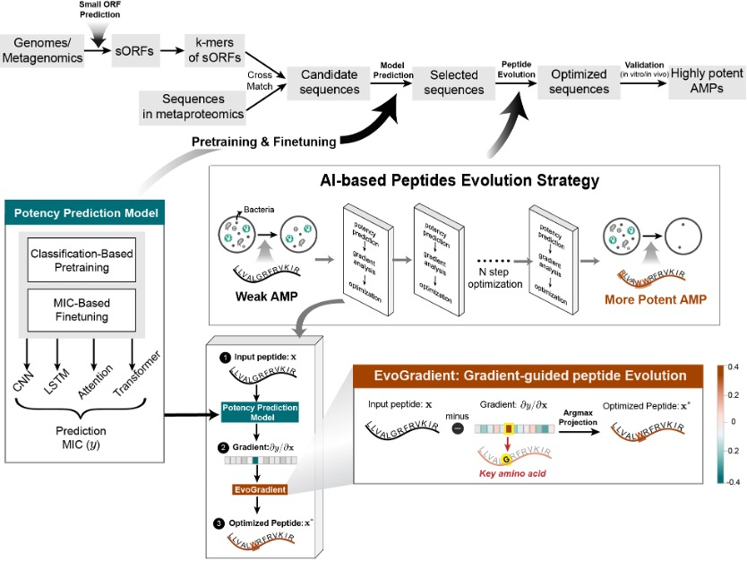

# AMP-Potency-Prediction-and-EvoGradient
A PyTorch implementation of "Explainable deep learning and virtual evolution identifies antimicrobial peptides with activity against multidrug resistant human pathogens".





## Installation
The environments and their corresponding versions are specified in [environment.yaml](./environment.yaml).

The recommended method of installation is through [conda](https://github.com/conda/conda). 
To install, run the following command:

```
conda env create -f environment.yaml -n myenv
source activate myenv
```
The installation should be within 1 hour on normal desktop computers. 

**Our program does not require any non-standard hardware. We recommend running it on device with GPUs to speed up execution.*

## Usage

### AMP classification
To predict peptide sequences as AMPs or non-AMPs, run the following command:
```
python AMP_classification.py --testPath './data/classification/PathToFastaFile' --savePath 'outputFilePath'
```
Note: input file must be fasta file. 

One Example is:
```
python AMP_classification.py --testPath './data/classification/demo.fasta' --savePath 'output/classification_result.csv'
```
Expected output: [`./output/classification_result.csv`](./output/classification_result.csv).


### AMP regression
To predict antimicrobial activity of peptide sequences, run the following command:
```
python AMP_regression.py --testPath './data/regression/PathToFastaFile' --savePath 'outputFilePath'
```
Note: input file must be fasta file. 

One Example is:
```
python AMP_regression.py --testPath './data/regression/demo.fasta' --savePath 'output/regression_result.csv'
```
Expected output: [`./output/regression_result.csv`](./output/regression_result.csv).

### EvoGradient: Directed Evolution 
To perform the directed evolution to increase antimicrobial activity of peptides, run the following command:
```
cd EvoGradient
python EvoGradient.py --peptide PeptideToOptimize
```
One Example is:
```
cd EvoGradient
python EvoGradient.py --peptide RPLIKLRSTAGTGYTYVTRK
```
Expected output: [`./EvoGradient/EvoResult`](./EvoGradient/EvoResult/RPLIKLRSTAGTGYTYVTRK).

### Expected run time on 1 NVIDIA GeForce RTX 2080 Ti
**AMP classification**:
The classification of peptides in `./data/classification/demo.fasta` (containing 18,084 sequences) took **9.39** seconds, with an average processing time of about 0.00052 seconds per sequence.

**AMP regression**:
The regression of peptides in `./data/regression/demo.fasta` (with 1,312 sequences) took **5.48** seconds, with an average processing time of about 0.00418 seconds per sequence.

**EvoGradient**:
For the demo sequence `RPLIKLRSTAGTGYTYVTRK`, processing took **7.42** seconds. Additionally, we tested 100 randomly generated peptides, ranging from 5 to 50 amino acids in length. It took 460.79 seconds, approximately 4.61 seconds per sequence.

## License
[This repository as a whole is under the Apache-2.0 license.](./LICENSE)


